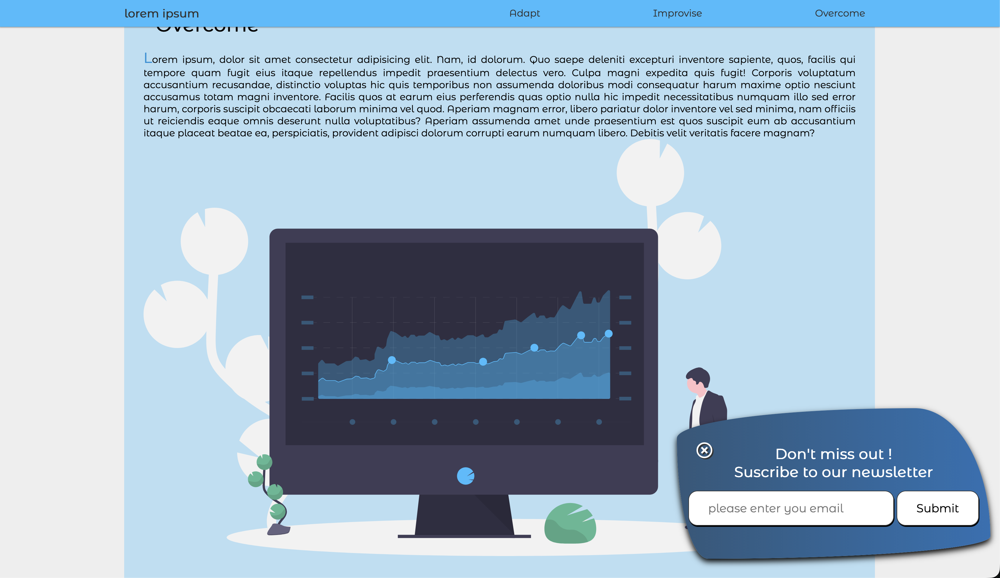

# 🖱️ Scroll-Motion UX - Interactive Navigation & Session Triggers

**Projet d'étude** focalisé sur la détection d'événements de défilement (Scroll) et l'implémentation de mécaniques d'interface dynamiques en JavaScript natif.
Une vitrine interactive démontrant comment le scroll utilisateur pilote le design : navigation adaptative, apparitions progressives (Reveal) et fenêtres contextuelles intelligentes.



## 🎯 Contexte & Objectifs Pédagogiques

Ce projet a été réalisé dans le cadre de mon **parcours de formation en autodidacte** pour maîtriser les interactions spatiales sur le Web.

L'objectif était de créer une interface "vivante" qui réagit à la progression de l'utilisateur, tout en intégrant des règles logiques pour ne pas nuire à l'expérience utilisateur (UX).

**Objectifs validés :**

- Manipulation de **`window.scrollY`** et calcul des hauteurs dynamiques du DOM.
- Création d'une **Navigation Adaptative** (Shrink Navbar) avec transitions fluides.
- Calcul de **seuil de visibilité** pour déclencher des animations de type "Slide-in".
- Gestion d'un **état de visibilité temporaire** pour les composants intrusifs (Pop-up).

## 🛠️ Stack Technique

- **Frontend :** HTML5, CSS3 (Focus sur les Transitions & le Linear-Gradient).
- **Scripting :** JavaScript Vanilla (ES6+).
- **Assets :** Illustrations vectorielles SVG.

## ✨ Fonctionnalités Développées

### 1. Navbar Dynamique (Effet Shrink)

Dès que l'utilisateur quitte le point zéro du scroll, la barre de navigation réduit sa hauteur de moitié. Cela permet de libérer de l'espace visuel pour le contenu tout en gardant les liens de navigation toujours à portée de clic.

### 2. Reveal Engine

Développement d'une logique d'apparition sur l'image de la section centrale. L'élément reste masqué et décalé (`translateX`) jusqu'à ce que l'utilisateur atteigne 45% de la hauteur totale du document, déclenchant une transition fluide vers sa position finale.

### 3. Pop-up de Rétention Intelligente

Affichage d'une fenêtre de newsletter lors de l'arrivée au bas de la page. Pour préserver l'expérience utilisateur, une logique d'état a été implémentée : une fois fermée, la pop-up ne réapparaît plus durant toute la session de lecture, même si l'utilisateur remonte et redescend en bas de page.

## 🏗️ Architecture du Code

Le projet utilise un écouteur d'événement global optimisé :

- **Calcul de progression :** Utilisation du ratio entre le scroll actuel, la fenêtre de vue (`innerHeight`) et la hauteur totale du document.
- **Gestion des états :** Utilisation d'un flag (booléen) ou d'une modification de propriété CSS pour neutraliser le déclencheur de la pop-up après la première fermeture.

## 🧠 Challenges Techniques Résolus

### La persistance négative de la Pop-up (Challenge Session)

Le défi était d'empêcher la pop-up de "spammer" l'utilisateur. Par défaut, si on lie l'affichage au scroll, chaque passage au bas de la page redéclenche l'animation.

- _Solution :_ Implémentation d'une condition logique lors du clic sur la croix de fermeture. En changeant la visibilité ou en désactivant le trigger JavaScript, on assure que la pop-up reste masquée jusqu'au prochain rechargement de la page (`Ctrl + R`).

### Universalité du "Bottom Page"

Le calcul du bas de page varie selon la taille de l'écran (mobile vs desktop).

- _Solution :_ Utilisation de `document.documentElement.scrollHeight - window.innerHeight` pour définir le point de contact exact avec le pied de page, garantissant que la pop-up surgit au moment opportun pour chaque utilisateur.

## ⚙️ Installation & Lancement

1. **Cloner le dépôt :**

```bash
git clone [https://github.com/EnzoRouet/Scroll-Motion-UX]
```

2. **Lancer le projet :**
   Ouvrez le fichier index.html dans votre navigateur.
